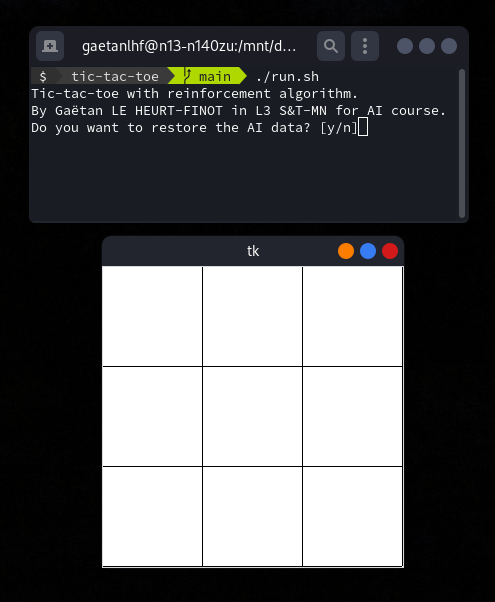
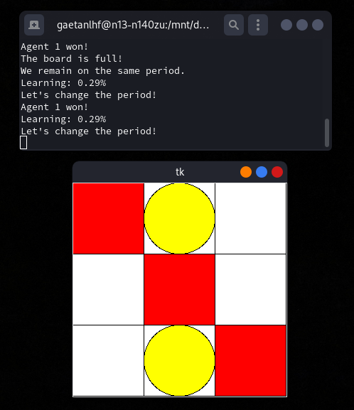

# RL Playground
 Discovery and application of a reinforcement learning algorithm (Q-Learning) on two small projects.

## Heaven and hells
An agent must find a way to heaven by avoiding the hells.  
He must therefore learn a strategy because he does not know the environment beforehand.

### Class diagram

### Screenshots

## Tic-tac-toe
Two agents play a game of tic-tac-toe.  
They have to learn from their actions.  
This learning can be stored in a file, and should allow a user to play against the computer. 

### Class diagram

### Screenshots

